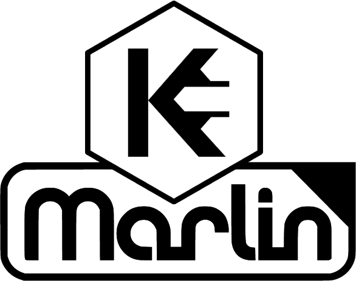

# Firmware Kuttercraft 5.1.7

To see Marlin's original resource you can go to [Marlin Home Page](https://marlinfw.org/).
Our version and improvements were created and tested only on the SKR 1.4 board with LCD12864 screen.

## Firmware_Kuttercraft 5.1.7 - Based on Marlin 2.0

At kuttercraft we love to research and develop, we have been working in 3D printer and software development since 2015 and after many years of learning we managed to share our knowledge in this firmware based on Marlin 2.0 to which we made many improvements and corrections.
We will continue in this same line developing improvements to be shared with the rest of the users.

To get to know us better, visit our website where you can see 3D printers and information about our work.
www.kuttercraft.com

## License

## Building Marlin_Kuttercraft 5.1.7

To build Marlin 2.0 you'll need [Arduino IDE 1.8.8 or newer](https://www.arduino.cc/en/main/software) or [PlatformIO](http://docs.platformio.org/en/latest/ide.html#platformio-ide). Detailed build and install instructions are posted at:

  - [Installing Marlin (Arduino)](http://marlinfw.org/docs/basics/install_arduino.html)
  - [Installing Marlin (VSCode)](http://marlinfw.org/docs/basics/install_platformio_vscode.html).

### Supported Platforms

  Platform|MCU|Example Boards
  --------|---|-------
  [LPC1768](http://www.nxp.com/products/microcontrollers-and-processors/arm-based-processors-and-mcus/lpc-cortex-m-mcus/lpc1700-cortex-m3/512kb-flash-64kb-sram-ethernet-usb-lqfp100-package:LPC1768FBD100)|ARM® Cortex-M3|MKS SBASE, Re-ARM, Selena Compact

## Credits

The current Marlin dev team consists of:

 - Scott Lahteine [[@thinkyhead](https://github.com/thinkyhead)] - USA &nbsp; [Donate](http://www.thinkyhead.com/donate-to-marlin)
 - Roxanne Neufeld [[@Roxy-3D](https://github.com/Roxy-3D)] - USA
 - Chris Pepper [[@p3p](https://github.com/p3p)] - UK
 - Bob Kuhn [[@Bob-the-Kuhn](https://github.com/Bob-the-Kuhn)] - USA
 - Erik van der Zalm [[@ErikZalm](https://github.com/ErikZalm)] - Netherlands &nbsp; 
 - Kuttercraft [www.kuttercraft.com](https://www.kuttercraft.com/)

## License

Marlin is published under the [GPL license](/LICENSE) because we believe in open development. The GPL comes with both rights and obligations. Whether you use Marlin firmware as the driver for your open or closed-source product, you must keep Marlin open, and you must provide your compatible Marlin source code to end users upon request. The most straightforward way to comply with the Marlin license is to make a fork of Marlin on Github, perform your modifications, and direct users to your modified fork.

While we can't prevent the use of this code in products (3D printers, CNC, etc.) that are closed source or crippled by a patent, we would prefer that you choose another firmware or, better yet, make your own.
